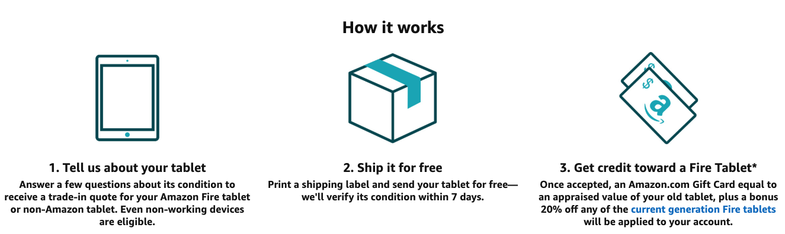

Did you know you can trade in your old tablet at Amazon.com and get a discount on a new tablet? Yes, for reals! In fact, if Amazon accepts your trade-in, they'll give you a gift card for the appraised value AND they'll credit your account with 20% off when you purchase a new Fire tablet!

Since we're all kind of stuck at home, there's no better time to dig up that old tablet that you're not using anymore and get an Amazon gift card for your troubles—and maybe even upgrade it to a new Fire tablet!

Amazon will send you a shipping label to print so you literally only need to find a box to ship it in to get the ball rolling.

Here's how the program works (click the image to view program):

1. ##### "Tell us about your tablet"
    * Answer a few questions about its condition to receive a trade-in quote for your Amazon Fire tablet or non-Amazon tablet. Even non-working devices are eligible.
1. ##### "Ship it for free"
    * Print a shipping label and send your tablet for free—we'll verify its condition within 7 days.
1. ##### "Get credit toward a Fire Tablet"
    * Once accepted, an Amazon.com Gift Card equal to an appraised value of your old tablet, plus a bonus 20% off any of the current generation Fire tablets will be applied to your account.

Currently, Amazon is accepting these older models: 
* Fire tablets
* iPads
* Samsung Galaxy tablets 
* Google Nexus tablets

<a href="https://amzn.to/2TVNxAM" class="btn btn-primary btn-block">View on Amazon</a>